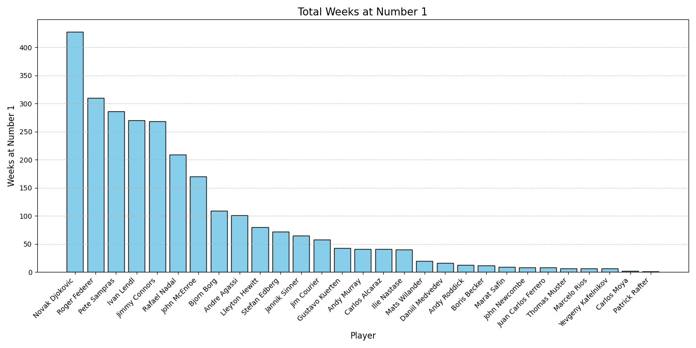

# ATP-Rankings-Data-Visualization
Python/SQLITE3 based project which scrapes data from the atptour.com and uses Matplotlib and database parsing for data visualization. Now includes a FastAPI web application to browse rankings data!

## Features
- 🎾 **Data Scraping**: Automated collection of ATP rankings from atptour.com
- 📊 **Data Visualization**: matplotlib-based charts and graphs
- 🗄️ **Database Management**: SQLite3 for efficient data storage
- 🌐 **Web Interface**: FastAPI application to browse rankings by week
- 📈 **Analysis Tools**: Command-line tools for player statistics

## Quick Start

### Web Application
Run the FastAPI web server to browse rankings:
```bash
python main.py
```
Then open your browser to `http://localhost:8000`

### Data Analysis
Use the command-line tools for specific analyses (see section 4 below)

## How to Use
The following is directions on how to setup, maintain, and analyze the data.
### 1. Setup
The project is dependent on multiple python modules. In order to ensure you have all the neccessary requirements, you can simply run the following command.
```
pip install -r requirements.txt
```
Additionally, update the database to get the latest rankings. The database file in this github only has the data up until 6/16/2025.
### 2. Database Maintenance
The repository comes with two files: ```generate.py``` and ```filler.py```. ```Generate.py``` is only meant to serve as a completely clean regeneration of the database. Should you need to regenerate the entire database, in case of an accidental deletion, you can simply run the file. ```Generate.py``` also comes with a start date variable, so if the script stops in between, you can restart the generation where it left off.
<br>
<br>
```Filler.py``` is the second, and more used of the two database files. As the name suggests, ```filler.py``` simply serves as an updater. **In order to get the latest data, run filler.py and do not generate.py.** ```Filler.py``` is dependent on ```generate.py``` for functions to add to the database. 
<br>
<br>
If you would like to preivew the database in GUI, my recommended tool is [here](https://sqlitebrowser.org/).
### 3. Debugging
The database might generate some blank/1 row tables while updating the datbase. To locate these tables, you can simply run debug.py. After this, manually delete an tables that only have 1 row. This will help to prevent errors while generating a list of number 1's or player factiles. 
### 4. Data Analysis
As the name suggests, ```analyze.py``` is used to perform data analysis. The file requires command arguments (much like linux). More detail on how to use these commands is [here](Examples/Examples.md), but attached is the analyze.py help menu, which can also be attained by running ```python3 analyze.py -h```
```
Usage: analyze.py [OPTION] <first_last> <first2_last2>

    Analyze ATP tennis data and generate visualizations.

    Options:
        -h            Show this help menu with all commands and their usage
        -n            Generate a bar graph using matplotlib of the ATP weeks at number 1
        -p            Generate a plot using matplotlib of a player's point history
        -r            Generate a plot using matplotlib of a player's ranking history
        -f            Show player factile

    Example:
        python analyze.py -p first_last first2_last2
            Generates and displays a plot of the selected player's point history. Supports multiple names.
        python analyze.py -f first_last
            Generates and outputs a player statistics factile of the selected player.
```

## 5. Web Application
The project includes a FastAPI web application for browsing rankings data through a modern web interface.

### Running the Web App
```bash
python main.py
```

The application will be available at `http://localhost:8000`

### Features
- **Home Page**: Browse all available weeks organized by year
- **Week Pages**: View complete rankings for any specific week
- **Search**: Find specific weeks or players
- **Navigation**: Previous/Next week buttons and keyboard shortcuts
- **API Endpoints**: Programmatic access at `/api/weeks` and `/api/week/{date}`

## Deployment

See [DEPLOYMENT.md](DEPLOYMENT.md) for detailed instructions on deploying to:
- GitHub (pushing your code)
- Render.com (recommended for beginners)
- Railway
- Fly.io
- Heroku

### Quick Deploy to GitHub
```bash
git add .
git commit -m "Initial commit"
git remote add origin https://github.com/YOUR_USERNAME/ATP-Rankings-Data-Visualization.git
git push -u origin main
```

## Technologies Used
- Python 3.12
- SQLite3
- BeautifulSoup4 (web scraping)
- Matplotlib (data visualization)
- FastAPI (web framework)
- Jinja2 (HTML templates)
- Uvicorn (ASGI server)

## License
See [LICENSE](LICENSE) file for details.
