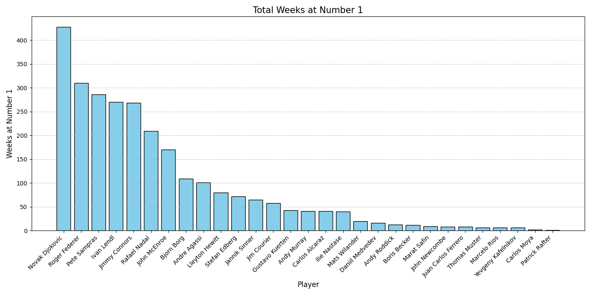

# ATP Rankings Data Visualization

[](https://safeskill.dev/scan/jupiterian-atp-rankings-api)
A comprehensive Python project for ATP tennis rankings data collection, analysis, and visualization. Features include web scraping, database management, interactive web interface, and AI integration via Model Context Protocol (MCP).

## Features

- ** Data Collection**: Automated scraping from atptour.com
- ** Database**: 2,600+ weeks of historical ATP rankings (1973-2025) 
- ** Web Interface**: Modern FastAPI application with interactive charts
- ** CLI Analysis**: Command-line tools for player statistics and comparisons
- ** AI Integration**: MCP server for AI assistant access
- ** Visualizations**: Matplotlib (CLI) and Chart.js (web) graphs
- ** Testing**: Comprehensive test suite with pytest

## Quick Start

### Installation

1. **Clone the repository**
   ```bash
   git clone https://github.com/Jupiterian/ATP-Rankings-Data-Visualization.git
   cd ATP-Rankings-Data-Visualization
   ```

2. **Install dependencies**
   ```bash
   pip install -r requirements.txt
   ```

3. **Run the web application**
   ```bash
   uvicorn src.main:app --reload
   ```
   
   Open your browser to `http://localhost:8000`

### Update Database

To get the latest rankings data:
```bash
python scripts/filler.py
```

## Project Structure

```
ATP-Rankings-Data-Visualization/
├── src/                      # Core application code
│   ├── main.py              # FastAPI web application
│   ├── services.py          # Business logic layer
│   ├── mcp_router.py        # MCP API endpoints
│   └── mcp_manifest.json    # MCP schema definition
├── scripts/                  # Utility scripts
│   ├── generate.py          # Regenerate entire database
│   ├── filler.py            # Update database with latest data
│   ├── analyze.py           # CLI data analysis tool
│   ├── debug.py             # Database debugging utility
│   ├── test_mcp.sh          # Quick MCP endpoint tests
│   ├── test_render_mcp.py   # Production deployment tests
│   ├── keep_alive.py        # Render free tier keep-alive
│   └── deploy.sh            # Deployment helper
├── docs/                     # Documentation
│   ├── MCP_README.md        # MCP server documentation
│   ├── MCP_DEPLOYMENT.md    # Deployment guide
│   ├── MCP_IMPLEMENTATION_SUMMARY.md
│   └── MCP_QUICK_REFERENCE.md
├── templates/                # HTML templates (Jinja2)
│   ├── index.html           # Home page
│   ├── week.html            # Weekly rankings
│   ├── comparison.html      # Player comparison
│   ├── weeks_at_no1.html    # Histogram visualization
│   └── api_docs.html        # API documentation
├── tests/                    # Test suite
│   └── test_mcp.py          # MCP endpoint tests
├── Examples/                 # Example visualizations
├── rankings.db              # SQLite database (2,600+ tables)
├── Dockerfile               # Container image
├── docker-compose.yml       # Docker Compose config
├── Procfile                 # Render/Heroku deployment
├── runtime.txt              # Python version
└── requirements.txt         # Python dependencies
```

## Web Application

### Features

- **Browse Rankings**: View all 2,600+ weeks organized by year
- **Player Search**: Autocomplete search across all players
- **Player Comparison**: Side-by-side statistics with career graphs
- **Weeks at #1**: Interactive histogram of world #1 rankings
- **API and MCP Access**: RESTful API with comprehensive documentation
- **Keyboard Navigation**: Arrow keys to navigate between weeks

### Running Locally

```bash
uvicorn src.main:app --reload
```

Access at `http://localhost:8000`

### API Endpoints

- `GET /` - Home page
- `GET /week/{week_id}` - Weekly rankings
- `GET /comparison` - Player comparison tool
- `GET /weeks-at-no1` - Weeks at #1 histogram
- `GET /api-docs` - API documentation
- `GET /api/weeks` - List all available weeks
- `GET /api/week/{week_id}` - Get week data
- `GET /api/search-players?q={query}` - Search players
- `POST /api/player-factfile` - Player statistics
- `POST /api/player-career` - Career time-series data

##  MCP Server (AI Integration)

The MCP server allows AI assistants like Claude to query ATP rankings data.

### MCP Endpoints

Base URL: `http://localhost:8000/mcp`

- `GET /mcp/health` - Health check
- `GET /mcp/manifest` - Server capabilities
- `POST /mcp/tools/search_players` - Search for players
- `POST /mcp/tools/get_player_factfile` - Player statistics
- `POST /mcp/tools/get_player_career` - Career history
- `GET /mcp/tools/get_weeks_at_no1` - Weeks at #1 leaderboard
- `GET /mcp/tools/get_all_weeks` - Available weeks list
- `POST /mcp/tools/get_week_rankings` - Specific week data

### Testing MCP

```bash
# Run test suite
pytest tests/test_mcp.py -v

# Quick smoke test
bash scripts/test_mcp.sh

# Test production deployment
python scripts/test_render_mcp.py https://your-app.onrender.com
```

**Full Documentation**: See [`docs/MCP_README.md`](docs/MCP_README.md)

## CLI Analysis Tools

### analyze.py

Analyze player data and generate matplotlib visualizations.

```bash
# Show player statistics
python scripts/analyze.py -f Roger_Federer

# Plot ranking history
python scripts/analyze.py -r Roger_Federer Rafael_Nadal

# Plot points history
python scripts/analyze.py -p Novak_Djokovic

# Weeks at #1 histogram
python scripts/analyze.py -n
```

**Options**:
- `-h` - Show help menu
- `-f` - Player factfile (statistics)
- `-r` - Ranking history plot
- `-p` - Points history plot
- `-n` - Weeks at #1 bar graph

**Examples**: See [`Examples/Examples.md`](Examples/Examples.md)

## Database Management

### Update Database (Recommended)

Add latest rankings data:
```bash
python scripts/filler.py
```

### Regenerate Database

Complete database rebuild (takes ~1 hour):
```bash
python scripts/generate.py
```

### Debug Database

Find and fix problematic tables:
```bash
python scripts/debug.py
```

### Browse Database

Recommended GUI tool: [DB Browser for SQLite](https://sqlitebrowser.org/)

## Deployment

### Deploy to Render (Free)

1. **Push to GitHub**
   ```bash
   git add .
   git commit -m "Deploy ATP Rankings"
   git push origin main
   ```

2. **Connect to Render**
   - Go to [render.com](https://render.com)
   - Click "New Web Service"
   - Connect your GitHub repository
   - Render auto-detects settings from `Procfile`

3. **Deploy**
   - Click "Create Web Service"
   - Wait 2-3 minutes for deployment

4. **Keep Alive (Optional)**
   ```bash
   python scripts/keep_alive.py https://your-app.onrender.com
   ```

**Full Guide**: See [`docs/MCP_DEPLOYMENT.md`](docs/MCP_DEPLOYMENT.md) for Railway, Fly.io, Heroku, Docker, and VPS options.

## Testing

```bash
# Run all tests
pytest tests/ -v

# Run with coverage
pytest tests/ --cov=src --cov-report=html

# Test specific module
pytest tests/test_mcp.py::TestMCPHealth -v
```

## Technologies

**Backend**:
- Python 3.12
- FastAPI (web framework)
- SQLite3 (database)
- Uvicorn (ASGI server)
- Pydantic (validation)

**Frontend**:
- Jinja2 (templates)
- Chart.js (interactive charts)
- HTML5/CSS3

**Scraping & Analysis**:
- BeautifulSoup4 (web scraping)
- Matplotlib (static visualizations)

**Testing & Deployment**:
- Pytest (testing framework)
- Docker (containerization)
- Render/Railway/Fly.io (hosting)

## License

See [LICENSE](LICENSE) file for details.

## Contributing

Contributions welcome! Please:
1. Fork the repository
2. Create a feature branch
3. Make your changes
4. Add tests
5. Submit a pull request

## Contact

For questions or issues, please open a GitHub issue.

---

** If you find this project useful, please star the repository!**
